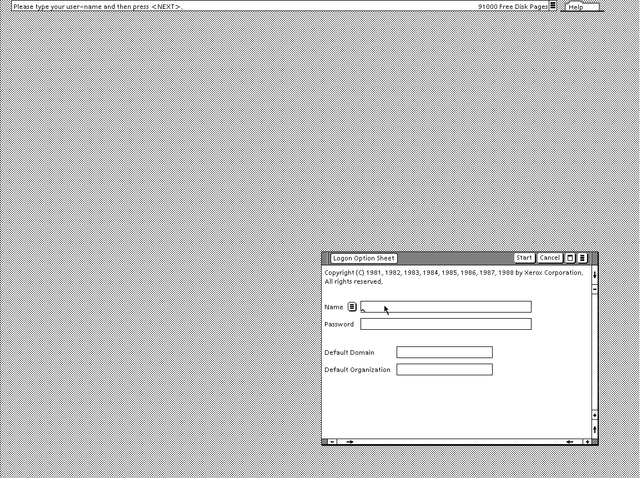
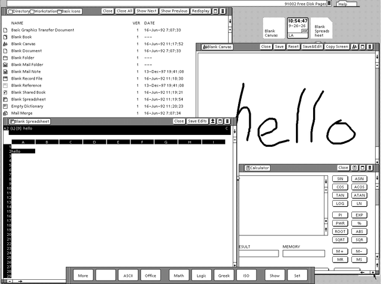

# Xerox 6085 "Daybreak" core for MiSTer

An FPGA implementation of the **Xerox 6085 Professional Computer System** for the
MiSTer platform: a microcoded Mesa workstation from 1985, running **Xerox's own
microcode**, the Pilot operating system and **ViewPoint 2.0.5**.

The 6085 - code-named **Daybreak**, and **Dove** in its IOP and software - was the
successor to the Xerox Star (8010). It runs the Mesa processor architecture on a
microcoded bit-slice CPU, with an Intel 80186 I/O processor handling the disk,
floppy, keyboard, mouse, display and Ethernet. The core boots ViewPoint from a
hard disk image to the logon screen and the desktop, installs ViewPoint from the
original floppies onto a blank disk, and saves and resumes sessions with
ViewPoint's quick restart.

No Xerox software is included. The microcode, the germ and Pilot are read from
**your own disk image**, as the real machine read them.

 
---

## The machine model

**Xerox 6085, Mesa microcode with a 4K control store.** The core models the
6085's central processor (the CP) at the level of its hardware - the four
**AMD Am2901C** 4-bit bit-slice ALUs that make its 16-bit datapath, their
64-word register file, the 256-word auxiliary U registers, the shifter, the
memory map and the interrupt register - closely enough to run Xerox's own
48-bit microinstructions unchanged: the same microcode file ViewPoint's disk
carries, `Mesadaybreak.db`. So the Mesa instruction set, the process scheduler
and the virtual memory are Xerox's code, not a reimplementation.

| | |
|---|---|
| **CP** | Microcoded Mesa processor: four Am2901C bit slices (16 bits), 48-bit microwords, 4K control store, **8 MHz processor clock** - one microinstruction every 125 ns. The core's machine clock is 32 MHz |
| **IOP** | Intel 80186 on the real machine; here the core's own firmware on a PicoRV32 RISC-V processor (see below) |
| **Memory** | 4 MB of SDRAM - ViewPoint reports 3968 K bytes |
| **Display** | 1152 × 861 monochrome bitmap |
| **Rigid disk** | ST-506 drives: the Micropolis 1325 (80 MB) and Quantum Q540 (40 MB) as templates; Xerox's self-describing disk (SDD) page is honoured |
| **Floppy** | 5.25-inch double density, Xerox's mixed FM/MFM format |
| **Keyboard / mouse** | The 6085 keyboard with its command keys; a two-button mouse (Point and Adjust) |
| **Software** | Pilot and ViewPoint 2.0.5 (not included) |

### Where the core is not a real 6085

This is the part that matters if you know the machine.

- **The IOP is not an 80186.** Xerox's IOP code talks to the CP through shared
  control blocks in memory; the core implements that protocol - the disk,
  floppy, display, keyboard and mouse, processor, beep, Ethernet time reply and
  the configuration EEPROM handlers - in its own firmware. Pilot cannot tell the
  difference; an 80186 program cannot run.
- **There are no boot soft keys.** A real 6085 shows F1/F2/F3 boot keys for 20
  seconds, loads the *initial microcode* from the chosen device, and then the
  Mesa microcode. The core boots straight into the Mesa microcode from the disk,
  or from the floppy with **Boot From Floppy** - the real F2.
- **The front panel's maintenance-panel display** is drawn in the bottom right
  of the picture when **Maintenance Panel** is on, instead of as cursor codes only.

---

## Core features

### Processor and system

- **Xerox's own microcode**, loaded from the disk's microcode file by the IOP at
  boot, run on a model of the CP's datapath: the four Am2901C slices, the U
  registers, the shifter, the memory map, the interrupt register and the 8254
  interval timers.
- **A microcode-level machine, not a Mesa interpreter.** Every 6085 emulator
  until now - Draco, Dawn, the Guam mesa-emulator - implements the Mesa
  instruction set directly in software. This core executes the microcode that
  implements Mesa, one 48-bit microinstruction at a time, as the 6085's
  hardware did - to our knowledge the first implementation of the 6085 to run
  its own Daybreak microcode. (Darkstar does the same for the 8010 Star's
  Dandelion microcode.)
- **Real time.** The Mesa clock, the interval timer and the time of day run on
  the machine's own clocks; the time of day comes from the MiSTer or the
  **Legacy 1997** option.

### Video

- **1152 × 861**, the 6085's own bitmap, at the 6085's 38 Hz, with the cursor
  drawn by the IOP as on the real machine.
- **Aspect ratio "Original"** is the 6085's 4:3 tube - its pixels were not square.

### Keyboard and mouse

- The **6085 keyboard**, including the function row (Center, Bold, Italic, ...)
  and the command keys (Open, Props, Copy, Move, ...) - see *Keyboard
  reference*.
- The 6085's **two-button mouse** through the MiSTer's: left **Point**, right
  **Adjust**. Pop-up menus are both buttons together, or Shift + left, as on
  the real machine - an ordinary two-button PC mouse does everything.

### Rigid disk

- **`.vhd` images**, read/write, one 1,024-byte record per page (512 bytes of
  data and the page's 20-byte label).
- The **self-describing disk page** (page 14) sets the geometry; an image
  without one is taken as the 80 MB Micropolis.
- **Blank formatted templates** for a fresh ViewPoint install, 40 MB and 80 MB
  (see *Disk images*).

### Floppy

- **`.imd` and `.dmk`** images, read-only, including Xerox's mixed-density
  cylinder 0.
- **Boot From Floppy** runs the ViewPoint Installer and the Offline Diagnostics.

### Quick restart

- ViewPoint's **Power off, quick restart** saves the session to disk and the next
  boot resumes it in seconds instead of minutes (see below).

---

## OSD options

| Option | What it does |
|---|---|
| **Mount Floppy** | `.imd`, `.dmk` - read-only |
| **Mount Disk** | The rigid disk, `.vhd`; remembered at the next start |
| **Boot From Floppy** | No / Yes - at power-on or Reset, boot the floppy in the drive instead of the disk (the real 6085's F2) |
| **Clock** | MiSTer RTC / Legacy 1997 - see *About the clock* |
| **Aspect Ratio** | Original (the 6085's 4:3 tube) / Full Screen |
| **Scale** | Normal / V-Integer / Narrower HV-Integer / Wider HV-Integer / HV-Integer |
| **Beep Volume** | Medium / Loud / Soft / Off - the keyboard beeper |
| **Maintenance Panel** | Off / On - the MP code and activity counters, bottom right |
| **Reset** | Restarts the machine; also the MiSTer's reset button |

### About the clock

ViewPoint's applications are unlocked by software-option passwords bound to the
processor ID. The known perpetual passwords (see the Darkstar readme, section
3.3.3) must be entered with the machine's clock in **December 1997**. To do that:

1. Set **Clock** to **Legacy 1997**.
2. **Cold boot** - Reset with no saved quick-restart session - and log on.
   ViewPoint's clock reads 15 December 1997.
3. Enter the passwords.
4. Set **Clock** back to **MiSTer RTC**. The next boot, or a quick-restart
   restore, picks up today's date.

A quick-restart restore keeps the clock it was saved with if the clock has since
moved *backwards* - the real 6085's battery-backed clock never did - so step 2
must be a cold boot. A clock that moved forward is taken as usual.

### About the maintenance panel

With **Maintenance Panel** on, two rows appear in the bottom right:

```
DSK:RRRR BBB FFF     SD requests in the last second, SD busy time, CPU held time
MP :dddd cccc BAD    the MP code (decimal), instructions / 64 K (hex), flags
```

The MP code is Pilot's progress or error code, as Xerox's manuals quote it
(7504, 7600, 0915, ...). **`BAD` is not an error**: it is three flags - **B**ooted,
**A**ctive (the CPU ran this frame), **D**isk mounted. A rising instruction count
means the machine is running, not hung.

---

## Installing on MiSTer

The core name is **`Xerox-6085`**, which is what MiSTer uses to find everything.

```
/media/fat/_Computer/Xerox-6085_YYYYMMDD.rbf
/media/fat/games/Xerox-6085/
        boot0.rom
        *.vhd  *.imd  *.dmk
```

**`boot0.rom` holds only the core's own IOP firmware** and is built with each
release. **Use the `boot0.rom` released with the `.rbf` you install** - the two
go together.

---

## Disk images

| Kind | Extension | Notes |
|---|---|---|
| **Rigid disk** | `.vhd` | 1,024 bytes a page (data + label). **Read/write** |
| **Floppy** | `.imd` | ImageDisk - sectors. **Read-only** |
| **Floppy** | `.dmk` | Raw tracks with ID tables and CRCs. **Read-only** |

### Blank disk templates

Two formatted, empty rigid disks, the way Xerox's formatter leaves a drive -
the physical volume root, the bad page table and the self-describing disk page:

| Template | Drive | Geometry | Size |
|---|---|---|---|
| `xerox-40mb-blank.vhd` | Quantum Q540 | 480 × 8 × 16 | 61,440 pages |
| `xerox-80mb-blank.vhd` | Micropolis 1325 | 960 × 8 × 16 | 122,880 pages |

Made by `python3 tools/mkblankvhd.py 40|80 OUT.vhd`. No Xerox software is on
them; the Offline Diagnostics' formatter is not needed.

### Installing ViewPoint on a blank disk

1. Mount a template as the disk, Installer #1 as the floppy, set **Boot From
   Floppy** to Yes and Reset.
2. Insert Installer #2 when asked.
3. At the Installer's main menu choose **3, Partition 6085 Workstation Disk**,
   then **1**, and confirm twice. It reports *Disk partitioned*.
4. Choose **2, Install ViewPoint Software (from floppies)** and follow the
   prompts through the floppy set.
5. Set **Boot From Floppy** to No and Reset.
6. **The first boot stops at MP 7504**, "volume needs initializing". This is
   expected once: **hold I and V together for about 30 seconds**, then release.
   It moves on to 7600 (ViewPoint booting), which can take a while the first
   time. *Only on a new install* - 7504 on a disk that has booted before means
   the volume needs a File Check, and initializing would erase it.

### Power off, quick restart

ViewPoint's "Power off, quick restart" saves the session to disk; the next boot
resumes it in seconds. It needs ViewPoint's Quick Restart application installed
(the "6085 Xerox ViewPoint 2.0.5 - tools" floppy). While the machine saves or
restores, the screen is white and the pointer shows the MP code, as on a real
6085.

---

## Known limitations

- **Floppies are read-only.**
- **No network** beyond the built-in reply to Pilot's time request. The Offline
  Diagnostics' Formatter waits for a time server that never answers; it is not
  needed with the templates.
- **No process tick.** A real 6085's initial microcode starts a 50 ms interval
  timer that times out Pilot's waits; the core skips that stage. ViewPoint does
  not notice; programs that wait on a timeout with nothing else happening can.
- **No boot soft keys, no 80186** - see *Where the core is not a real 6085*. The
  80186 PC-emulation option does not run.
- **The keyboard's EDIT and ESC keys** have no mapping.

---

## Keyboard reference

Letters, digits and punctuation are themselves. Ctrl is only a modifier here -
the 6085 has no Ctrl key - so Ctrl with any other key is that key.

| PC key | 6085 key | | PC key | 6085 key |
|---|---|---|---|---|
| `F1` | Center | | `Ctrl-O` | Open |
| `F2` | Bold | | `Ctrl-P` | Props |
| `F3` | Italic | | `Ctrl-C` | Copy |
| `F4` | Case | | `Ctrl-M` | Move |
| `F5` | Strikeout | | `Ctrl-N`, `Page Down`, keypad `Enter` | Next |
| `F6` | Underline | | `Ctrl-F` | Find |
| `F7` | Super/Sub | | `Ctrl-A` | Again |
| `F8` | Smaller (Larger/Smaller) | | `Ctrl-S` | Same |
| `F9` | Margins | | `Ctrl-U` | Undo |
| `F10` | Font (Looks) | | `Ctrl-H` | Help |
| `Esc` | Stop | | `Enter` | New Paragraph |
| `Backspace` | BS | | `Delete` | Delete |
| `Caps Lock` | Lock | | `` ` `` | Open Quote |
| `Alt` | Special (Meta) | | `AltGr` | Expand |

**F12** stays the MiSTer's OSD key. The mouse buttons are the 6085's: left
**Point**, right **Adjust**; both together (or Shift + left) for a pop-up
menu. A PC mouse's middle button is passed through as the Menu key code Draco
uses - an extra; the 6085's mouse had two buttons.

---

## Credits and attributions

### Core development

- **Diego Viso** ([@diegov-au](https://github.com/diegov-au)) - core development, hardware testing and verification.

### Special Thanks

- **Dr. Hans-Walter Latz** - author of **Dwarf** and its 6085 incarnation
  **Draco** ([github.com/devhawala/dwarf](https://github.com/devhawala/dwarf)).
  Draco boots the same ViewPoint disk, and it was this project's golden model
  from the first instruction: every stage of the core was traced against it.
  Draco is a high-level emulator - it interprets Mesa instructions directly in
  Java and never runs the 6085's microcode - which is what made it such a good
  reference: two independent machines, one executing the Mesa instruction set and
  one executing the microcode beneath it, agreeing instruction by instruction.
  The ViewPoint 2.0 and XDE 5.0 disk images the core was developed on come
  from the Dwarf project.

### Hardware and software sources

- The **6085 Technical Reference** volumes, the **IOP** design documents and the
  **6085 Field Engineering training guide** - the memory map, the CP's datapath,
  the IOP's devices, the boot sequence and the MP codes.
- The **Xerox PARC archive at the Computer History Museum** - the Daybreak Mesa
  microcode source and the Pilot sources, the authority for what the microcode
  expects of the machine.
- **bitsavers** - the manuals, and a real Xerox-formatted Seagate ST-251 image
  from which the templates' volume root and bad page table were read.
- The IOP's configuration EEPROMs are served from dumps of real 6085 IOP boards.

### Framework and vendored cores

- **[MiSTer](https://github.com/MiSTer-devel/Main_MiSTer)** framework (`sys/`) by
  **Alexey Melnikov (Sorgelig)**, **Till Harbaum** and the MiSTer-devel community -
  HPS interface, video scaling, audio output and the OSD.
- **[PicoRV32](https://github.com/YosysHQ/picorv32)** by **Claire Xenia Wolf** -
  the RISC-V processor that runs the IOP firmware (ISC licence).
- **The SDRAM controller and PLL** - from this project's Superman core,
  unmodified.

---

## Licence

**GPL-2.0**, matching the MiSTer framework in `sys/`. PicoRV32 is ISC.
Xerox's microcode, germ, Pilot and ViewPoint are not part of this core.

---

This core was developed with the assistance of AI. The RTL, the IOP firmware,
the simulation harness and the documentation were written collaboratively with
AI, with every behaviour verified against Xerox's own microcode, the Draco
emulator, the technical manuals and a real DE10-Nano.
